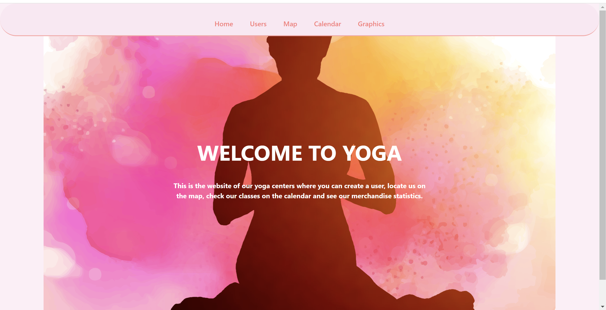
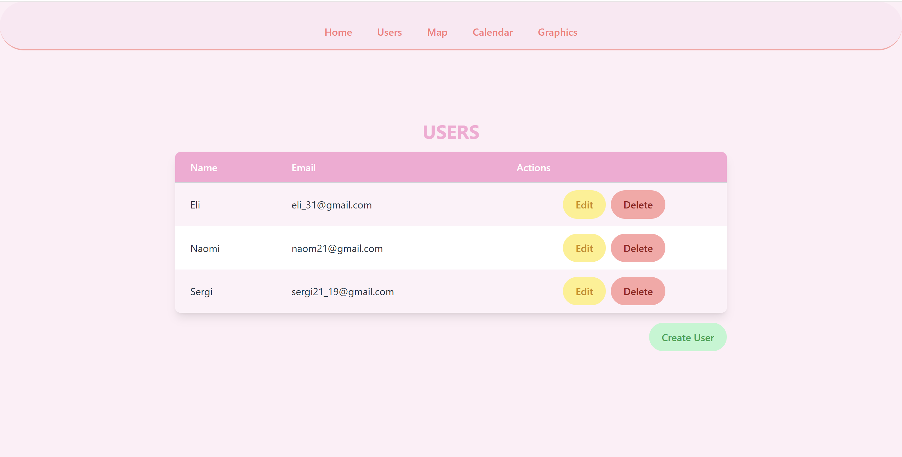
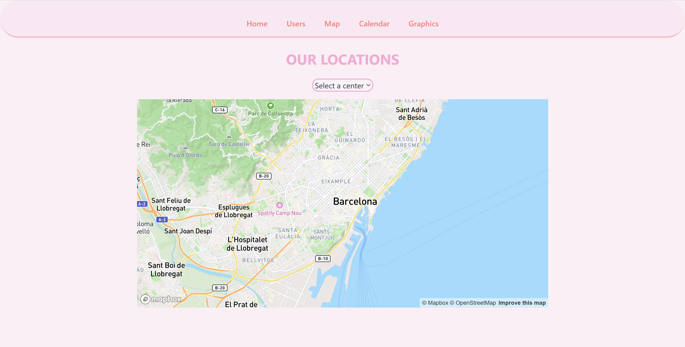
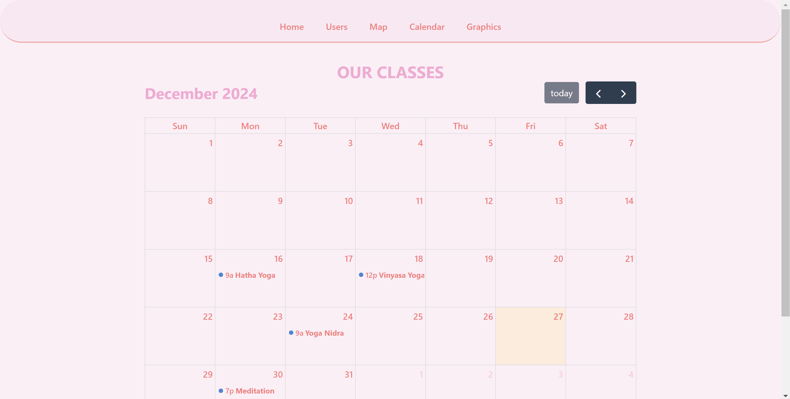
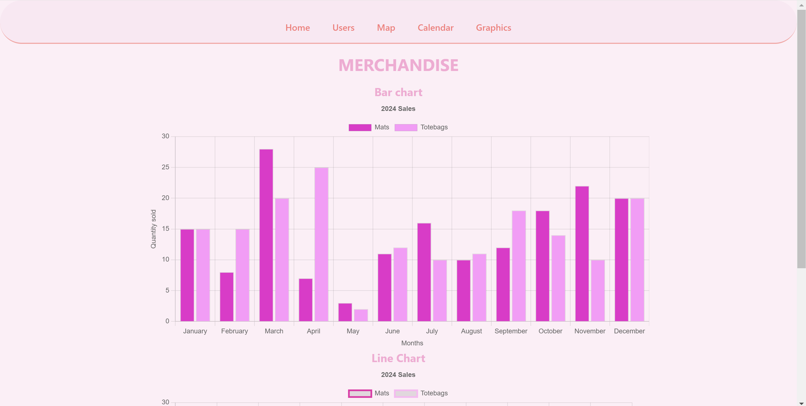

# Yoga Centers - Website
Sprint 8. A web application for managing yoga centers.

## Introduction

This project is a web platform where users can view classes on a calendar, locate centers on a map, analyze merchandise sales statistics, and manage users.







## Features
- **User Management**: create, edit and delete registered users.
- **Interactive Map**: view yoga center locations using MapBox.
- **Class Calendar**: view scheduled classes, dynamically add and remove events.
- **Sales Statistics**: visual data analysis of merchandise sales using Chart.js

## Requirements

Ensure you meet the following requirements before running the project:

- **Frontend**:
  - Node.js (version 14 or higher).
  - npm (version 6 or higher).
  - React (compatible versions with the code)
  - React Router DOM (v6 or higher)
  - Tailwind CSS (version 2 or higher)
  - Modern browser (Google Chrome, Firefox, etc.).
- **Backend**:
  - MySQL (for data storage).
  - A tool like MySQL Workbench for database management (optional).

## Technologies Used
- Frontend:
  - **React + Vite**
  - **Tailwind CSS**
  - **React Router**
  - **Axios**
  - **FullCalendar**
  - **Mapbox**
  - **Chart.js**
  
- Backend:
  - **Node.js**
  - **Express**
  - **MySQL**
 
## Instructions

### 1. Clone the repository

First, clone the repository to your local machine:

```bash
git clone https://github.com/Naomigarcia99/Yoga.git
cd Yoga
```
### 2. Install dependencies

- Frontend:
```bash
  npm install
```
- Backend:
```bash
  cd Back
  npm install
```
### 3. Configure Environment Variables
- Create a database named yoga_centers
- Create .env files for both the client and server with the required variables:
```bash
DB_HOST=localhost
DB_USER=your_user
DB_PASSWORD=your_password
DB_NAME=yoga_centers
PORT=3002
```

### 4. Run the aplication
To start the application, use the following command:
- Backend:
```bash
 cd Back
 npm run start
```
- Frontend:
```bash
 cd Yoga
 npm run dev
```
